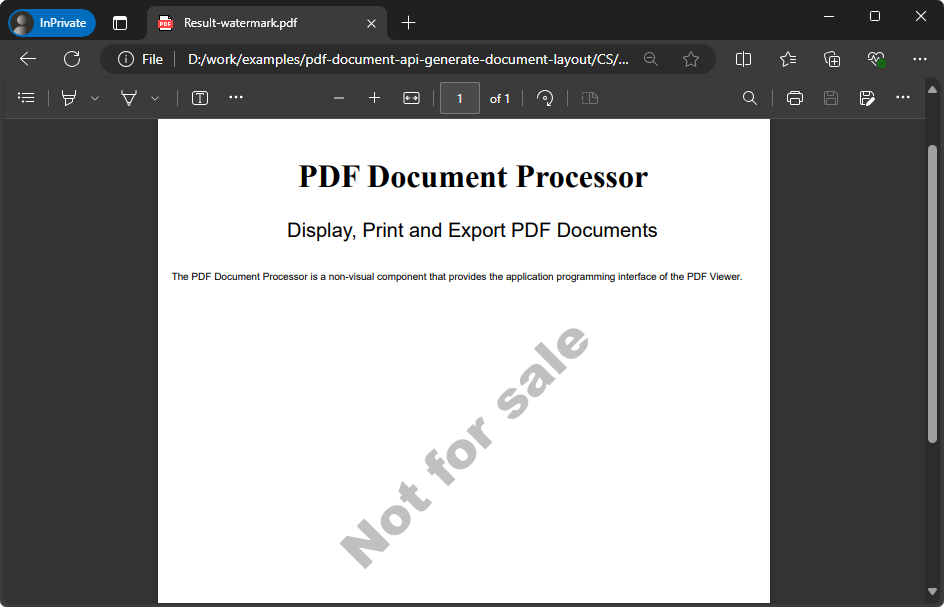

<!-- default badges list -->

<!-- default badges end -->
<!-- default file list -->

# PDF Document API - Generate a Document Layout from Scratch

This example shows the PDF Document Creation API that is used to programmatically generate a document layout.

- The custom `DrawGraphics` method draws content inside an empty PDF document.
- The custom `AddWatermark` method generates a watermark with custom text and adds it to the created PDF document.

When you launch the app, the file is saved to your Documents folder (`%userprofile%/Documents`). 

The [Result.pdf](Result.pdf) file is an example of a generated PDF document:

The Universal Subscription or Office File API Subscription is required to use this example in production code. Please refer to the [DevExpress Subscriptions](https://www.devexpress.com/Subscriptions/) page for pricing information.

# Files to Review

* [Program.cs](./CS/DocumentCreationAPI/Program.cs) (VB: [Program.vb](./VB/DocumentCreationAPI/Program.vb))
* [Result.pdf](Result.pdf)
<!-- default file list end -->

# Documentation

- [How to: Generate a PDF Document Layout from Scratch](https://docs.devexpress.com/OfficeFileAPI/114824/pdf-document-api/examples/pdf-graphics-and-additional-content/how-to-generate-a-document-layout-from-scratch)
- [Document Generation](https://docs.devexpress.com/OfficeFileAPI/118794/pdf-document-api/document-generation)

<!-- feedback -->
## Does this example address your development requirements/objectives?

 

(you will be redirected to DevExpress.com to submit your response)
<!-- feedback end -->
